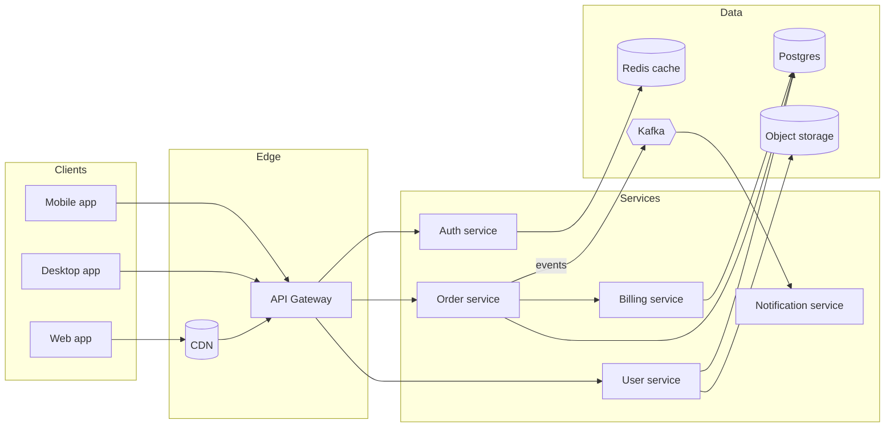

Here is the system architecture:

```mermaid
flowchart LR
  subgraph Clients
    Web[Web app]
    Desktop[Desktop app]
    Mobile[Mobile app]
  end
  subgraph Edge
    CDN[(CDN)]
    GW[API Gateway]
  end
  subgraph Services
    Auth[Auth service]
    Users[User service]
    Orders[Order service]
    Billing[Billing service]
    Notify[Notification service]
  end
  subgraph Data
    PG[(Postgres)]
    Redis[(Redis cache)]
    Kafka{{Kafka}}
    S3[(Object storage)]
  end
  Web --> CDN --> GW
  Desktop --> GW
  Mobile --> GW
  GW --> Auth
  GW --> Users
  GW --> Orders
  Orders --> Billing
  Orders -- events --> Kafka
  Kafka --> Notify
  Users --> PG
  Orders --> PG
  Billing --> PG
  Auth --> Redis
  Users --> S3
```

Requests enter through the gateway; order events fan out over Kafka.
