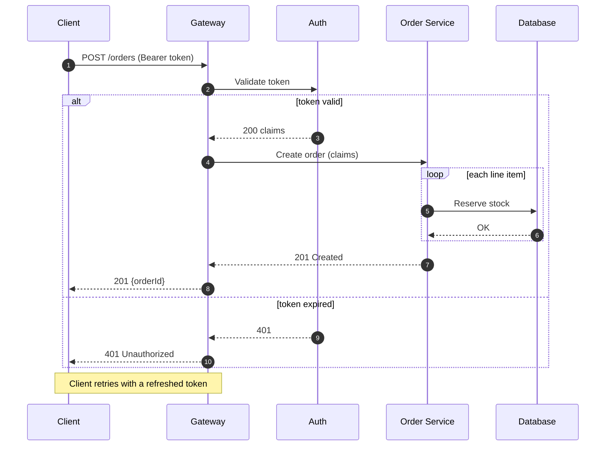

The full lifecycle of an authenticated API request:

```mermaid
sequenceDiagram
  autonumber
  participant C as Client
  participant G as Gateway
  participant A as Auth
  participant S as Order Service
  participant D as Database
  C->>G: POST /orders (Bearer token)
  G->>A: Validate token
  alt token valid
    A-->>G: 200 claims
    G->>S: Create order (claims)
    loop each line item
      S->>D: Reserve stock
      D-->>S: OK
    end
    S-->>G: 201 Created
    G-->>C: 201 {orderId}
  else token expired
    A-->>G: 401
    G-->>C: 401 Unauthorized
  end
  Note over C,G: Client retries with a refreshed token
```
